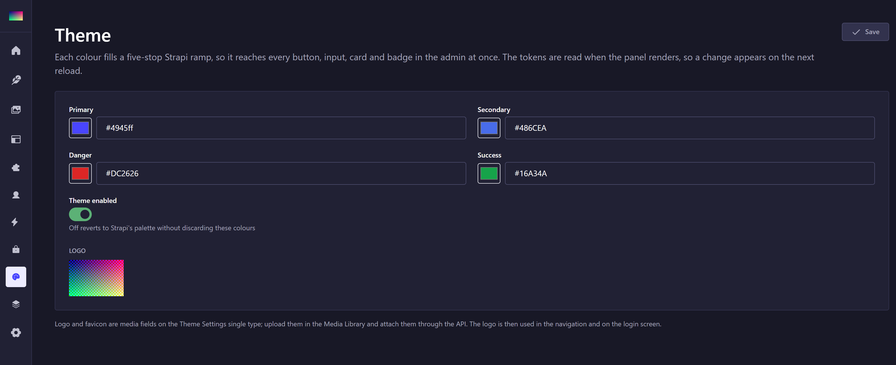
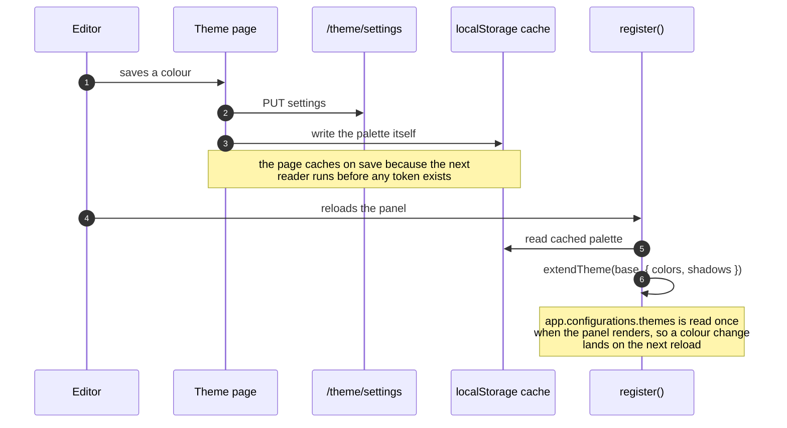

# strapi-plugin-theme

[](https://www.npmjs.com/package/strapi-plugin-theme)    

Recolour the Strapi 5 admin panel from the database. Four brand colours and two brand
images, applied through Strapi's own design tokens — so one change reaches every button,
input, card, badge and table in the panel at once.

One of a family of standalone Strapi 5 plugins — see [the others](https://github.com/rhyoharianja?tab=repositories).

## Install

```bash
pnpm add strapi-plugin-theme
```

```ts
// config/plugins.ts
export default {
  'theme': { enabled: true, resolve: 'strapi-plugin-theme' },
};
```

> **Keep the key `theme` exactly as it is.** It is the plugin id, and the id is
> compiled into the package — the admin menu link, the `plugin::theme.*`
> custom-field uids, the route prefix and every internal `strapi.plugin(...)` lookup.
> Renaming it does not rename those, so the plugin half-loads and fails in ways that do
> not look like a naming problem. `resolve` points at the package; the key does not.

### Installing under pnpm

`resolve: 'strapi-plugin-theme'` is enough for npm and yarn, whose `node_modules` is flat. It is
**not** enough for pnpm: `@strapi/core` runs `require.resolve` from its own location inside
`node_modules/.pnpm/`, where your app's dependencies are not on the resolution path, and the
lookup fails with `MODULE_NOT_FOUND`.

Give it the package **directory** instead:

```ts
// config/plugins.ts
import { createRequire } from 'node:module';
import { dirname } from 'node:path';

// `__dirname`, not `import.meta.url`: Strapi compiles config files to CommonJS.
const requireFromApp = createRequire(`${__dirname}/`);

const resolvePlugin = (packageName: string) => ({
  resolve: dirname(requireFromApp.resolve(`${packageName}/package.json`)),
});

export default {
  'theme': { enabled: true, ...resolvePlugin('strapi-plugin-theme') },
};
```

It must be the **directory**, not the path to `package.json`. Two loaders read this value and
disagree about what it is: the server treats it as a path, while the admin build treats it as
the plugin's directory and reads `package.json` → `exports["./strapi-admin"]` from it. Point
it at the file and the admin build looks for `package.json/package.json`, finds nothing, and
**silently ships an admin bundle with no trace of the plugin** while the server half keeps
working — which makes it a genuinely hard failure to spot.

## The page



Four pickers, not twenty: each base colour fills a five-stop Strapi ramp, and the tints and
shades are derived.

## How it works



Each configured colour fills a five-stop Strapi ramp (`100`, `200`, `500`, `600`, `700`).
Only the base is asked for; the tints and shades are derived, so the form has four colour
pickers instead of twenty. The button tokens (`buttonPrimary500/600`) and the focus ring are
derived from the primary as well — miss those and the palette and the buttons drift apart.

The palette is applied by **extending Strapi's theme object**, using the Design System's
documented `extendTheme`:

```ts
app.configurations.themes[mode] = extendTheme(base, { colors, shadows: { focus } });
```

Two things about that matter:

- **The Design System is themed through a styled-components theme object**, not CSS custom
  properties — the only `var(--…)` it reads are Radix internals. A stylesheet cannot recolour
  the panel. The only CSS that *appears* to work is aimed at internal class names, and it
  breaks unrelated UI: an early version of this plugin used `main button[type="submit"]` and
  painted Puck's block palette with the brand colour.
- **`extendTheme` clones.** Writing into Strapi's exported `lightTheme` in place, as a still
  earlier version did, made a page reload the only way back to the original tokens.

`app.configurations.themes` is read once when the panel renders, so this runs during
`register()` and **a colour change appears on the next reload**, not the moment it is saved.
The last known palette is cached in `localStorage` so the panel does not flash Strapi's
colours on the way to yours.

Why the cache is written by the *page* rather than by `bootstrap`: a plugin's `bootstrap`
cannot authenticate. Strapi 5 keeps the access token in memory behind an httpOnly refresh
cookie and the React layer only obtains it during render — after `bootstrap` — so a fetch from
there goes out as `Bearer null` and the route answers `401`. That cost real debugging time
before it was understood, which is why it is written down here rather than left implicit.

## Editing

The Theme Settings single type is hidden from the Content Manager — that list is for content,
not platform configuration — so the plugin has its own page under **Theme** in the
navigation.

Logo and favicon are media fields on that single type: upload them in the Media Library and
attach them through the API. The logo is then used in the navigation and on the login screen
(`app.configurations.menuLogo` / `authLogo`).

## Theme Settings fields

| Field | Type | Default |
| ----- | ---- | ------- |
| `primaryColor` | string | `#4945ff` |
| `secondaryColor` | string | `#7b79ff` |
| `dangerColor` | string | `#d02b20` |
| `successColor` | string | `#328048` |
| `logo` / `favicon` | media | — |
| `enabled` | boolean | `true` |

Colours are validated against a hex pattern **in the schema and again per field when read**,
so a bad value degrades to the default instead of producing an unreadable panel. Setting
`enabled` to `false` reverts to Strapi's palette without discarding the configured colours.

The single type is seeded with defaults on first boot, so the entry is immediately editable.

## API

| Method | Route | Purpose |
| ------ | ----- | ------- |
| GET | `/theme/settings` | Current palette |
| PUT | `/theme/settings` | Update it |

Both are admin routes with no permission gate: every authenticated admin user needs the
colours in order to render the panel.

> On a fresh login the plugin's `bootstrap` cannot read them. Strapi 5 keeps the access token
> in memory behind an httpOnly refresh cookie and the React layer only obtains it during
> render — after `bootstrap` — so the request goes out as `Bearer null` and the route answers
> 401. The settings page writes the cache itself when it saves, which is what makes the
> colours stick from then on.

## Scope

Colours, the two brand images, and nothing else.

An earlier version of this plugin also carried a corner radius, a spacing density, a type
scale, a font family, colour presets, and three navigation layouts — including a replacement
sidebar of its own, rendered in a second React root and spliced into Strapi's shell. That was
removed deliberately, and the reasoning is worth keeping:

- **Colours cannot half-work.** They are one token write that every component reads.
- **Structure can.** Strapi's docs are explicit that *"the core navigation UI cannot be
  overridden"*; `addMenuLink` is the only navigation API. Reaching past it meant either CSS
  aimed at Strapi's internals or a second React root, and the second never reliably rendered.
- **`borderRadius` is a single token**, so per-component geometry (a 14px card next to an 8px
  button) is not expressible anyway, and table cell padding is one `spaces[4]` on all four
  sides.

Two findings from that attempt cost real time and are worth stating plainly: the admin's
base is `1rem === 10px`, not 16px, and Vite creates a **separate module instance per import
specifier**, so the same package imported two ways gives you two copies of its state.

## Scripts

| Script | Description |
| ------ | ----------- |
| `pnpm build` | `strapi-plugin build` — admin + server bundles |
| `pnpm dev` | `strapi-plugin watch` (use in a workspace) |
| `pnpm verify` | Publish-readiness check |
| `pnpm lint` | Type-check both halves |
| `pnpm test` | Colour validation and ramp derivation |

> In a monorepo use `watch`, not `watch:link` — pnpm's workspace symlink already handles the
> linking that `watch:link` exists to set up.

## Support

These plugins are free and MIT-licensed. If one saved you a day of work, you are welcome to
say thanks:

[](https://www.paypal.com/paypalme/sgkharianja)
[](https://saweria.co/rhioharianja)

Bug reports and pull requests are worth just as much.

## License

MIT © Suryo Galih Kencana Harianja
